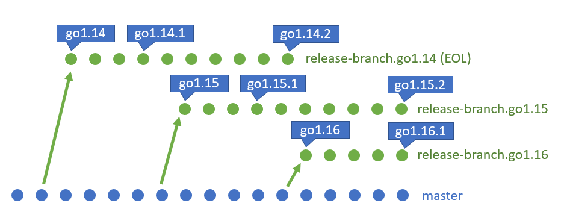
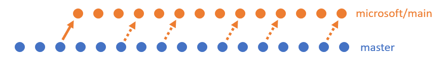

# Branch strategy

This doc describes how upstream Go manages its release branches, and how the
corresponding release branches in microsoft/go are created.

The upstream Go repository (https://go.googlesource.com/go, mirrored at
https://github.com/golang/go) starts off each `X.Y` major release by forking a
`release-branch.goX.Y` branch from `master`. Per the [release
policy](https://golang.org/doc/devel/release#policy), each release is maintained
until there are two newer major releases.

After a release branch is forked, there are no further merges from (or to)
`master`, or any other release branch. Fixes are performed in `master` then
cherry-picked to each applicable branch.

This results in straightforward Git repository history. An example (version
numbers not accurate):



> A horizontal line of circles represents a series of commits in a branch, with
parent commits to the left and children to the right. Arrows represent
additional `parent -> child` links. The callout boxes are Git tags, created for
each minor release.

The microsoft/go repository maintains a set of `microsoft/*` branches associated
with upstream branches. Each `microsoft/*` branch initially forks from upstream,
then periodically merges in all changes from the upstream branch. The
`microsoft/main` branch is associated with `master`:



> A dashed arrow points from a commit to a merge commit that includes it.

How does a new `microsoft/*` branch get created when upstream creates a release
branch? There are two possible situations, which are discussed in the next
sections: steady state and retroactive branch creation.

## Steady state release branch

Say we have an actively maintained `microsoft/main` branch, then upstream forks
a branch for a 1.42 release.


We first find the *merge base* ("best" common ancestor, per Git) of the release
branch and `master`. Then, we merge that commit into `microsoft/main` and create
a `microsoft/release-branch.go1.42` branch on the same commit:


> The merge-base commit is circled.

> Starting with both branches pointing at the same commit ensures that merge
conflicts (if any) only need to be solved once. This saves time, and eliminates
the chance of accidentally resolving the conflict differently for each branch.

Then, we periodically merge each upstream branch into its corresponding
`microsoft/*` branch. The branches diverge naturally along with the branch
they're associated to:


Release branch creation is complete.

## Retroactive release branch (Go 1.16 and earlier)

The `microsoft/main` branch hasn't always existed. It was created some time
after Go 1.16 was released. `release-branch.go1.16` and earlier upstream release
branches have already diverged from `master`. The situation looks like this:


To apply the Microsoft build infrastructure on top of the 1.16 branch, we
isolate the infrastructure changes, then cherry-pick them on top of the release
branch to create `microsoft/release-branch.go1.16`.

To do that, we use these Git commands:

```sh
# Assume these Git remotes are set up:
# msft = https://github.com/microsoft/go, golang = https://github.com/golang/go
#
# Initialize the microsoft/go repo's branch with the tip of the upstream branch.
# We will submit the infra changes as a PR against this branch to try out CI.
git push msft golang/release-branch.go1.16:microsoft/release-branch.go1.16

# Check out the infra in the main branch. A branch other than main could
# be used if it's closer to the target. We check out the remote ref (golang) to
# detach HEAD and isolate these commands from any other WIP.
git checkout msft/microsoft/main

# Find the most recent commit shared by the master and microsoft/main branches.
# If we reset to that commit in 'soft' mode, all the infra changes (and *only*
# the infra changes) are put into our Git stage.
merge_base=$(git merge-base msft/microsoft/main golang/master)
git reset --soft $merge_base

# Commit the isolated infra changes and save the commit hash for later.
git commit -m "Add Microsoft build infrastructure"
x=$(git rev-parse HEAD)

# Check out the target release, create the associated microsoft/* branch, then
# cherry-pick the isolated infra changes.
git checkout golang/release-branch.go1.16
git checkout -b microsoft/release-branch.go1.16
git cherry-pick $x

# Push the WIP release branch to a fork and submit a PR against the microsoft/go
# branch. Use this branch to do any infra fixups necessary to make CI pass.
git push [...]
```

After that, we periodically merge the release branch into the corresponding
`microsoft/*` branch. We end up with the same branch arrangement for ongoing
work as the other approach, just with a different history:


Release branch creation is complete.

# How to apply `microsoft/main` infra fixes to a release branch?

When upstream applies a Go fix from `master` to release branches, the fix is
cherry-picked on top of each branch. We follow suit and cherry-pick
infrastructure fixes onto each applicable branch.

Upstream doesn't merge among/between release branches and `master`. This
prevents us from merging, too, because the `microsoft/*` branches include the
upstream commits associated with that branch. If we tried to merge
`microsoft/main` into `microsoft/release-branch.go1.42`, we would be trying to
merge every commit in upstream `master` into upstream's `release-branch.go1.42`.

[microsoft/go#145](https://github.com/microsoft/go/issues/145) tracks automation
and alternatives to cherry-picking.
